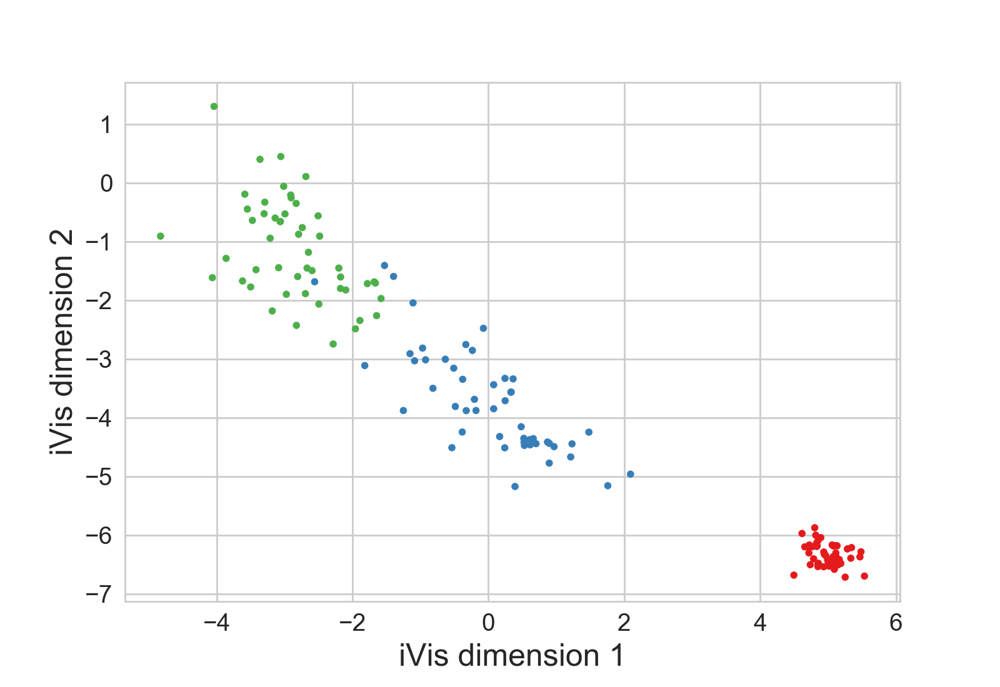

# ivis

Implementation of the ivis algorithm as described in the paper 'Structure-preserving visualisation of high dimensional single-cell data with deep Siamese Neural Networks'.  

This algorithm uses a siamese neural network trained on triplets to reduce the dimensionality of data to two dimensions for visualization. Each triplet is sampled from one of the <i>k</i> nearest neighbours as approximated by the Annoy library, with neighbouring points being pulled together and non-neighours being pushed away.

## Installation

After cloning this repo run: `pip install -e .` from the root of the project.

## Examples

```
from ivis import Ivis
from sklearn import datasets

iris = datasets.load_iris()
X = iris.data
y = iris.target

model = Ivis(embedding_dims=2, k=15)

embeddings = model.fit_transform(X)
```

Plotting the embeddings results in the following visualization:


